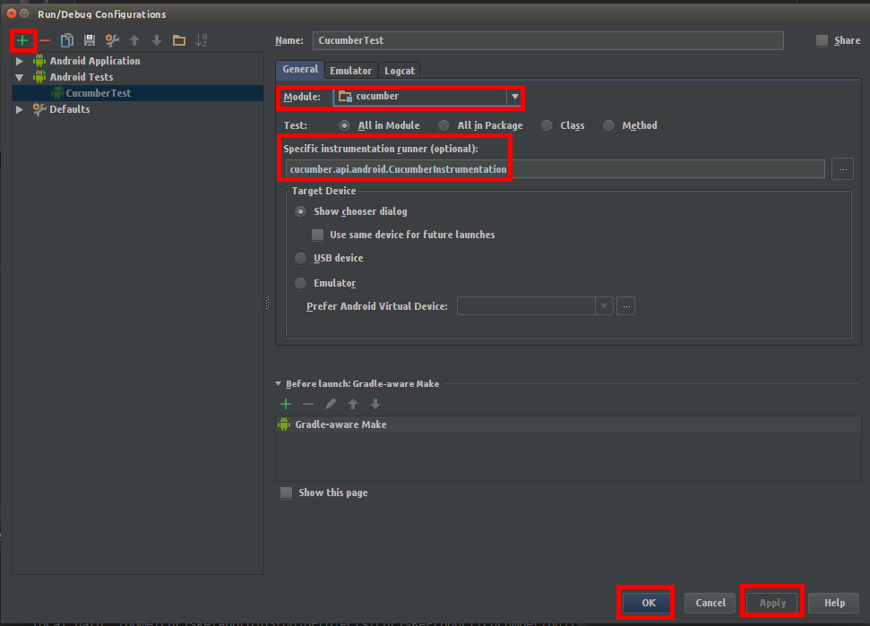
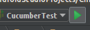
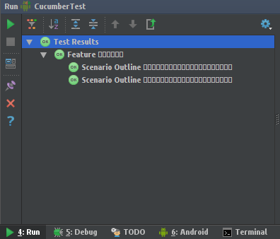
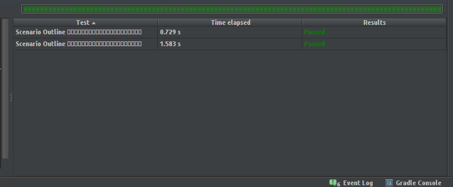

# 最簡範例

* src/main/java/com/packagename/MainActivity.class

```java
import android.os.Bundle;
import android.support.v7.app.AppCompatActivity;
import android.view.View;
import android.widget.Button;

public class MainActivity extends AppCompatActivity {
    public int clickCount = 0;
    public Button button;

    @Override
    protected void onCreate(Bundle savedInstanceState) {
        super.onCreate(savedInstanceState);
        
        // 建立一個按鈕，按下幾次中間的數字就會顯示次數。
        button = new Button(this);
        button.setText(String.valueOf(clickCount));
        button.setOnClickListener(new View.OnClickListener() {
            @Override
            public void onClick(View view) {
                clickCount++;
                button.setText(String.valueOf(clickCount));
            }
        });

        setContentView(button);
    }
}
```

* src/androidTest/assets/features/clickbutton.feature

```
Feature: 按下按鈕累加
    按下按鈕後按鈕中間的文字會遞增。

    Scenario Outline: 一個使用者按下按鈕，按鈕中間會顯示典籍次數
        Given 我會看到 MainActivity 被開啟
        When 我按下中間的按鈕 <num> 次
        Then 我會看到按鈕中的文字顯示 <count> 這個數字

    Examples:
        | num | count |
        | 2   | 2     |
        | 3   | 3     |
```

*  src/androidTest/java/com/packagename/test/MainActivitySteps.class


```java
import android.test.ActivityInstrumentationTestCase2;
import com.cucumber.MainActivity;
import org.junit.runner.RunWith;
import cucumber.api.CucumberOptions;
import cucumber.api.java.en.Given;
import cucumber.api.java.en.Then;
import cucumber.api.java.en.When;
import cucumber.api.junit.Cucumber;

@RunWith(Cucumber.class)
@CucumberOptions(features = "features/clickbutton.feature")
public class MainActivitySteps extends ActivityInstrumentationTestCase2<MainActivity> {
    
    // 開啟 Activity。
    public MainActivitySteps() {
        super(MainActivity.class);
    }

    @Given("^我會看到 MainActivity 被開啟$")
    public void I_have_my_activity() {
        // 確認 Activity 是否有被開啟。
        assertNotNull(getActivity());
    }

    @When("^我按下中間的按鈕 (\\d) 次$")
    public void I_click_button_d_times(int count) {
        for (int i = 0; i < count; i++) {
            // 按鈕動作要執行在主執行緒中，這裡使用 runOnUiThread() 方法。
            getActivity().runOnUiThread(new Runnable() {
                @Override
                public void run() {
                    getActivity().button.performClick();
                    // 以自己的物件作同步鎖定，執行 notifyAll() 通知等待中的行程。
                    synchronized (MainActivitySteps.this) {
                        MainActivitySteps.this.notifyAll();
                    }
                }
            });
            // 以自己的物件作同步鎖定，執行 wait() 等待按下的動作執行完畢，才執行下一次點擊。
            synchronized (MainActivitySteps.this) {
                try {
                    MainActivitySteps.this.wait();
                } catch (InterruptedException e) {
                    e.printStackTrace();
                }
            }
        }
    }

    @Then("^我會看到按鈕中的文字顯示 (\\S+) 這個數字$")
    public void I_should_see_s_on_the_button(String example) {
        assertEquals(example, getActivity().button.getText());
    }
}

```

* 設定任務



* 執行



* 結果 (Android Studio 不支援中文，只能顯示方塊。)



